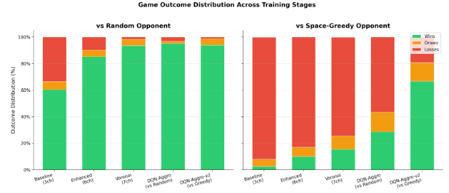
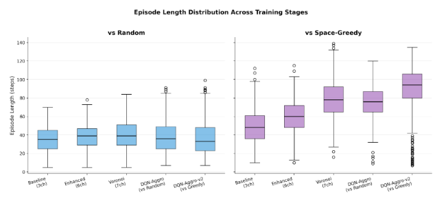
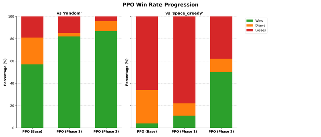

### Video

<div class="video-container">
    <video controls width="640" height="360">
        <source src="{{ 'assets/175-final-video.mp4' | relative_url }}" type="video/mp4">
        Your browser does not support the video tag.
    </video>
</div>

### Project Summary

Our project studies how to train intelligent agents for Tron, an arcade-style light-cycle game where two players move simultaneously on a grid and leave permanent trails that become walls. The problem we address is learning a policy that can make strong decisions in real time under adversarial pressure: the agent must avoid immediate collisions while also planning several steps ahead to control space and force the opponent into losing positions. This is challenging because the game state changes every turn, rewards are delayed (good or bad consequences often appear later), and a locally “safe” move can still lead to a strategic loss. In other words, the agent must reason about both short-term survival and long-term territorial advantage in a non-stationary environment where both players continuously reshape the board.

The goal of the project is to design, train, and evaluate reinforcement learning agents that can discover effective survival and trapping strategies directly from game observations, then compare value-based and policy-based approaches in the same environment. We evaluate methods such as DQN and PPO against heuristic opponents using win rate, survival time, and cumulative reward. This problem is not trivial to solve with hand-written rules alone: heuristics can handle obvious local dangers, but they break down across the enormous number of possible board configurations and opponent responses. AI/ML is necessary because reinforcement learning can learn nuanced, high-dimensional decision patterns from experience, enabling behaviors like zoning, baiting, and timing that are difficult to encode manually and essential for strong competitive play.

### Approaches

**Baseline:** Our baseline model uses a `RandomOpponent` that selects uniformly from non-lethal moves each turn. This strategy tends to succeed early when the board is sparse, but fails to create strategic order as the game progresses. This serves as a reliable baseline to verify that our learned models are using long-term planning and achieving success in later game stages.

---

#### Deep Q-Networks (DQN)

Deep Q-Networks (Mnih et al., 2013) combine value-based Q-learning with deep neural networks to handle high-dimensional state spaces. The core idea is to learn an action-value function Q(s,a) that estimates the expected cumulative reward for taking action a in state s. The key algorithm is **experience replay**: past transitions are stored in a buffer and sampled uniformly for training, which breaks temporal correlations in the data stream and improves sample efficiency.

We use Double DQN (van Hasselt et al., 2016) to mitigate overestimation bias and Dueling DQN (Wang et al., 2016) to separately learn state value and action advantages. These enhancements allow the network to learn more robust value estimates.

**Data Structure**

The replay buffer stores transitions in a circular array:

| Component        | Shape / Type | Description                             |
| ---------------- | ------------ | --------------------------------------- |
| State s_t        | (7, 20, 20)  | 7-channel grid observation              |
| Action a_t       | int ∈ [0, 3] | Discrete action (UP, RIGHT, DOWN, LEFT) |
| Reward r_t       | float        | Immediate reward                        |
| Next state s_t+1 | (7, 20, 20)  | Resulting state                         |
| Done flag d_t    | bool         | Episode termination indicator           |

Buffer capacity: 200,000 transitions (standard for mid-scale tasks; Mnih et al., 2015 used 1M for Atari).

**Data Sampling**

Each training iteration, we sample a minibatch of 128 transitions uniformly at random:

```
function SampleMinibatch(replay_buffer, batch_size):
    indices = random_integers(0, len(replay_buffer), batch_size)
    batch = replay_buffer[indices]
    return batch.states, batch.actions, batch.rewards, batch.next_states, batch.dones
```

For Prioritized Experience Replay (optional enhancement), transitions are sampled proportionally to their TD error (magnitude of temporal difference). Importance-sampling correction weights scale down high-probability transitions to prevent bias. Hyperparameters: alpha=0.6 (prioritization strength), beta=0.4 (importance-weight annealing start), epsilon=small constant for numerical stability (Schaul et al., 2016).

**Loss Equation**

DQN minimizes the Huber loss (Huber, 1964) to handle outliers:

$$\mathcal{L}(\theta) = \mathbb{E}_{(s,a,r,s',d)} \left[ \mathcal{H} \Big( r + \gamma Q_{\theta^-}(s', \arg\max_{a'} Q_\theta(s', a')) \cdot (1-d) - Q_\theta(s, a) \Big) \right]$$

where Huber loss clips gradients for outliers:

- Q(theta): online network weights
- Q(theta'): target network weights (updated every 10,000 steps)
- gamma = 0.99: discount factor (standard; Sutton & Barto, 2018)
- d: done flag (masks future rewards at episode end)

**Dueling architecture** (Wang et al., 2016) decomposes the Q-value:

$$Q(s,a) = V(s) + \left( A(s,a) - \frac{1}{|A|}\sum_{a'} A(s,a') \right)$$

This allows separate learning of state value V(s) and action advantages A(s,a), improving stability and generalization.

**Tron Application**

_Observation Space:_ 7-channel grid (20×20 pixels):

- Ch 0: Blocked cells (walls + both agents' trails)
- Ch 1: Agent head position (one-hot encoded)
- Ch 2: Opponent head position (one-hot encoded)
- Ch 3: Agent's own trail (one-hot encoded)
- Ch 4: Normalized BFS distance to nearest obstacle [0, 1]
- Ch 5: Reachable area via flood-fill from agent head
- Ch 6: Voronoi territory (1 if agent closer, 0 if opponent closer, 0.5 if tied)

_Action Space:_ Discrete(4) representing {UP, RIGHT, DOWN, LEFT}. Reverse moves (immediate 180° turn) and instantly lethal moves are masked during exploration via the action masking heuristic.

_Reward Structure:_

- +1 per step survived
- +10 for winning (opponent crashes)
- -10 for losing (agent crashes)
- +0.1 × (agent territory - opponent territory) / total cells (Voronoi shaping bonus, per step)

_Training Schedule:_

- Total environment steps: 2,000,000
- Warm-up steps before training: 20,000 (allow buffer to accumulate)
- Training frequency: every 4 steps (standard; Mnih et al., 2015)
- Target network hard-update: every 10,000 steps
- Total training duration: ~500k gradient updates

_Hyperparameters:_

| Parameter              | Value           | Source / Justification                                                    |
| ---------------------- | --------------- | ------------------------------------------------------------------------- |
| Buffer capacity        | 200,000         | Standard for mid-scale (Mnih et al., 2015 used 1M for Atari)              |
| Batch size             | 128             | Increased from 32 (Mnih et al., 2015) for stability on smaller grid       |
| Discount (gamma)       | 0.99            | Standard default (Sutton & Barto, 2018)                                   |
| Learning rate          | 1e-4            | Standard for Adam optimizer in DQN literature                             |
| Warm-up steps          | 20,000          | Tuned to ensure 10% buffer filled before learning begins                  |
| Train frequency        | Every 4 steps   | Standard (Mnih et al., 2015)                                              |
| Target update interval | 10,000 steps    | Standard hard-update interval (Mnih et al., 2015)                         |
| Epsilon start          | 1.0             | Standard; full exploration initially                                      |
| Epsilon end            | 0.05            | Tuned; lower than typical 0.1 to encourage exploitation of learned policy |
| Epsilon decay duration | 1,000,000 steps | Tuned empirically; decays over ~50% of total training                     |
| PER alpha              | 0.6             | Default (Schaul et al., 2016)                                             |
| PER beta start         | 0.4             | Default; anneals to 1.0 over training (Schaul et al., 2016)               |

---

**Network Architecture**

CNN backbone: 4 convolutional layers (ReLU activations):

- Conv(in=7, out=32, kernel=3×3, stride=2, padding=1)
- Conv(in=32, out=64, kernel=3×3, stride=2, padding=1)
- Conv(in=64, out=128, kernel=3×3, stride=2, padding=1)
- Conv(in=128, out=128, kernel=3×3, stride=2, padding=1)
- Flatten → FC(512, ReLU)

Dueling heads:

- Value head: FC(512 → 1)
- Advantage head: FC(512 → 4)
- Combined: Q = V + (A - mean(A))

---

#### Proximal Policy Optimization (PPO)

PPO (Schulman et al., 2017) is a policy gradient method that learns a stochastic policy pi(a\|s) and value function via clipped policy objectives. Unlike DQN, PPO is **on-policy**: it collects fresh trajectories from the current policy for each update. The clipping mechanism prevents large, destabilizing policy updates.

**Data Structure**

Rollout buffer (2,048 steps): observations, actions, log-probabilities, rewards, done flags, value estimates, and action masks.

**Data Sampling**

Data collected on-policy via rollout:

```
while episode_not_done:
    action, log_prob, value, mask = policy.select_action(obs)
    obs, reward, done = env.step(action)
    store(obs, action, log_prob, reward, value, done, mask)
```

After rollout, compute GAE advantages, shuffle, and update over 10 epochs in minibatches of 64.

**Loss Equation**

GAE (Schulman et al., 2016): Generalized Advantage Estimation with gamma=0.99, lambda=0.95.

PPO combines three components: clipped policy loss, value loss, and entropy bonus:

$$\mathcal{L}^{\text{CLIP}}(\theta) = \hat{\mathbb{E}}_t\left[\min\left(r_t(\theta)\,\hat{A}_t,\ \text{clip}\left(r_t(\theta),\,1-\varepsilon,\,1+\varepsilon\right)\hat{A}_t\right)\right]$$

$$\mathcal{L}^{V}(\theta) = \frac{1}{2}\left(V_\theta(s_t) - \hat{R}_t\right)^2$$

$$\mathcal{L}(\theta) = \mathcal{L}^{\text{CLIP}}(\theta) - c_v\,\mathcal{L}^{V}(\theta) + c_e\,S[\pi_\theta](s_t)$$

$$\mathcal{L}(\theta) \text{ where } r_t(\theta) = \frac{\pi_\theta(a_t|s_t)}{\pi_{\text{old}}(a_t|s_t)}, \quad \varepsilon = 0.2, \quad c_v = 0.5, \quad c_e = 0.01$$


**Tron Application**

Observation, actions, rewards: identical to DQN. Training: 2M total steps, 2,048-step rollouts, 10 epochs per update. Action masking applied during policy sampling.

**Hyperparameters:**

| Parameter        | Value | Source                          |
| ---------------- | ----- | ------------------------------- |
| Rollout length   | 2,048 | CleanRL / Schulman et al., 2017 |
| Update epochs    | 10    | CleanRL                         |
| Discount (gamma) | 0.99  | Standard                        |
| GAE lambda       | 0.95  | Schulman et al., 2016           |
| Learning rate    | 3e-4  | CleanRL default                 |
| Entropy coef     | 0.01  | CleanRL                         |
| Value coef       | 0.5   | CleanRL                         |
| Grad norm clip   | 0.5   | CleanRL                         |

---

**Network Architecture:** Shared 4-layer CNN (32, 64, 128, 128 filters) → FC 512 → actor (4 logits) and critic (1 value) heads.

---

#### Curriculum Training

Both DQN and PPO were trained using a two-phase curriculum (inspired by the status report findings):

1. **Phase 1 (1M steps):** Train against `RandomOpponent` to build basic survival and evasion reflexes.
2. **Phase 2 (1M steps):** Load Phase 1 checkpoint and train against `SpaceGreedyOpponent`, which greedily maximizes reachable area (Voronoi territory).

This curriculum was critical: direct training against `SpaceGreedyOpponent` from scratch failed to converge, confirming that agents benefit from learning fundamentals on weaker opponents before adapting to skilled adversaries.

---

#### Action Masking and Observation Design

**Action Masking Heuristic:** Both algorithms prevent selecting moves causing immediate collision (hitting walls or trails):

```
function GetSafeActions(obs):
    blocked_cells = obs[0]
    agent_head = extract_position(obs[1])
    safe_actions = []

    for action in [UP, RIGHT, DOWN, LEFT]:
        next_head = agent_head + action_delta[action]
        if in_bounds(next_head) and not blocked_cells[next_head]:
            safe_actions.append(action)

    return safe_actions if non-empty else [all actions]
```

This prevents trivial learning failures where agents spend countless steps crashing into walls.

**7-Channel Observation Space:** Designed to provide complementary spatial signals:

| Channel | Content                   | Purpose                             |
| ------- | ------------------------- | ----------------------------------- |
| 0       | Blocked cells             | Direct state representation         |
| 1-2     | Agent & opponent heads    | Immediate position awareness        |
| 3       | Agent trail               | Own movement history                |
| 4       | BFS distance to obstacle  | Reachability without lookahead      |
| 5       | Flood-fill reachable area | Free space from agent's perspective |
| 6       | Voronoi territory         | Relative space control metric       |

This representation significantly outperformed simpler 3-channel baselines (blocked, self head, opponent head) and provided agents with strategic information for long-term planning.

### Evaluation

We evaluated our DQN agent against 2 heuristic baseline opponents: a random agent, which selects at random from a set of non-lethal actions, and a space-greedy agent, that greedily maximizes its Voronoi territory, Voronoi meaning the amount of free cells that the agent is closer to than its opponent. All evaluations are conducted on a 20x20 grid, over 500 games, with fixed random seeds for reproducibility. We measured two primary metrics: win rate (percentage of games where the opponent crashes first) and average episode length (how long the game lasted), which aims to capture the agent’s survival skill.

#### DQN vs. Random/Space-Greedy Opponent Training Progression



**Figure 1.** Win Rate Progression across the 5 training stages.

This figure shows the win rate progression across the 5 training stages. The baseline DQN agent, with 3 channel observation, only achieved a 60.4% win rate against the random opponent. The 6 channel agent added in three new channels that helped the agent understand its surroundings better, which raised its win rate to 85% against the random opponent. Finally, we introduced a Voronoi territory channel to the agent, which raised its win rate to 93.5% against the random opponent. All of these agents were trained against the random opponent.

At this point, we decided to move our sights onto the space-greedy agent, which our current agent was performing quite poorly against (15.5% win rate). We knew that to beat the space_greedy agent, we would need more than just observational improvements. And so we reevaluated our model architecture, rewards, and training stages. We started by expanding the CNN from 3 layers to 4 layers, with the hope that this would give the agent the ability to learn more complex patterns. We also added a small territory based reward, with the idea of giving the agent more nuanced feedback, although this reward could be seen as pushing the agent towards a certain strategy (space_greedy), and so we may remove it later. Finally, we decided to train this agent in two stages. We first trained the agent against the random opponent, in order to build basic survival skills. From there, we took that agent and trained it against the space greedy opponent. This two step approach made sure that the agent could establish fundamentals, to compete and meaningfully learn from facing a strong opponent.

#### DQN Game Outcome Distribution



**Figure 2.** Game Outcome Distribution Across Training Stages.

This figure shows the game length distribution of the different DQN agents we trained. All the games vs random seemed to average out to 35 steps, reflecting the random agent’s poor survival skills. In contrast, the games against space_greedy’s agent were significantly longer, and increased as our agent’s skill increased, indicating that our model’s survival skills were the bottleneck, and not space_greedy’s.

#### PPO Agent Training and Algorithm Comparison



**Figure 3.** PPO Win Rate Progression across training phases.

Next, we decided to try to train a PPO agent, as PPO is generally considered better for complex, high dimensional, or continuous control tasks, compared to DQN. Taking the same reward structure and input channels from our highest performing DQN agent, We first started by training PPO directly against space_greedy, which did not perform very well. So we decided to try the curriculum training approach, training PPO (Phase 1) against the random opponent, with the goal of developing basic survival behavior, and taking the Phase 1 policy and continuing to train it against space_greedy. This progression proved effective, as the agent improved steadily across phases, ultimately achieving a 50% win rate against space_greedy.

However, despite these improvements, DQN still outperformed PPO in our setting. We believe this is because of how, in Tron, the action space is small and discrete, only consisting of 4 movement choices. This setting favors DQN, since the network can directly estimate the value of each possible action, and select the best one at every step. PPO, on the other hand, outputs probabilities for the 4 possible moves, a style that is more effective with fine grained/continuous control (e.g steering), but is not a great fit for this problem.

### Resources Used

**Tools & Libraries:**

- NumPy: numerical computations and array operations (Harris et al., 2020)
- PyTorch: neural network implementation and deep learning (Paszke et al., 2019)
- Gymnasium: standard RL environment API (Towers et al., 2023)
- Pygame: visualization and human-vs-AI gameplay (Pygame Community, n.d.)

**Algorithmic References:**

- Huber, P. J. (1964). Robust estimation of a location parameter. Annals of Mathematical Statistics, 35(1), 73-101.
- Mnih, V., Kavukcuoglu, K., Silver, D., et al. (2013). Playing Atari with Deep Reinforcement Learning. arXiv preprint arXiv:1312.5602.
- Mnih, V., Badia, A. P., Mirza, M., et al. (2016). Asynchronous Methods for Deep Reinforcement Learning. In International Conference on Machine Learning (ICML).
- van Hasselt, H., Guez, A., & Silver, D. (2016). Deep Reinforcement Learning with Double Q-learning. In AAAI Conference on Artificial Intelligence.
- Wang, Z., de Freitas, N., & Lanctot, M. (2016). Dueling Network Architectures for Deep Reinforcement Learning. In International Conference on Machine Learning (ICML).
- Schulman, J., Moritz, P., Levine, S., Jordan, M., & Abbeel, P. (2016). High-Dimensional Continuous Control Using Generalized Advantage Estimation. In International Conference on Learning Representations (ICLR).
- Schulman, J., Wolski, F., Dhariwal, P., Radford, A., & Klimov, O. (2017). Proximal Policy Optimization Algorithms. arXiv preprint arXiv:1707.06347.
- Schaul, T., Quan, J., Antonoglou, I., & Silver, D. (2016). Prioritized Experience Replay. In International Conference on Learning Representations (ICLR).
- Dhariwal, P., Hesse, C., Klimov, O., et al. (2017). OpenAI Baselines. https://github.com/openai/baselines
- Sutton, R. S., & Barto, A. G. (2018). Reinforcement Learning: An Introduction (2nd ed.). MIT Press.

**CleanRL Implementation:**

- Default hyperparameters from CleanRL: Clean Implementations of Deep Reinforcement Learning Algorithms. https://github.com/vwxyzjn/cleanrl

**AI Tool Usage:**

- ChatGPT and Claude: code assistance, algorithm explanation, error analysis, and report grammar check
